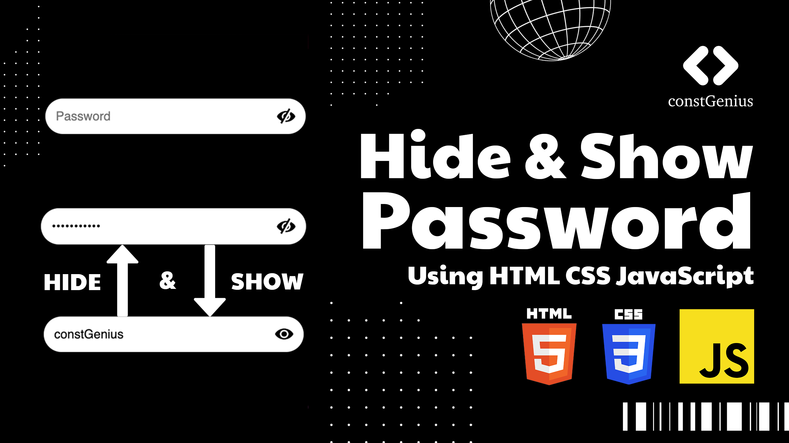

# Hide and Show Password using HTML CSS JavaScript | Password Toggle with JavaScript

Learn how to enhance user experience on your website by implementing a 'Hide/Show Password' feature using the power of HTML, CSS, and JavaScript. Discover the simple yet effective method to toggle password visibility, allowing users to securely enter their credentials with ease. Empower your website with this intuitive functionality to ensure a seamless and user-friendly browsing experience.

Live Preview: https://constgenius.github.io/HideShowPassword/

